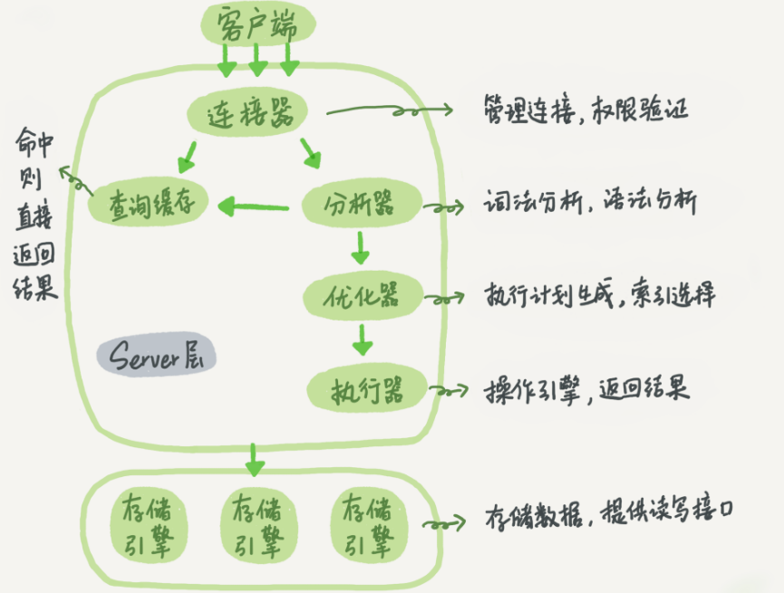

# 一条查询SQL语句的执行流程

MySQL各组件的逻辑架构图

从宏观上看，MySQL可以分为Server和存储引擎两个部分。

Server 层包括连接器、查询缓存、分析器、优化器、执行器等，涵盖 MySQL 的大多数核心服务功能，以及所有的内置函数（如日期、时间、数学和加密函数等），所有跨存储引擎的功能都在这一层实现，比如存储过程、触发器、视图等。

存储引擎层负责数据的存储和提取。其架构模式是插件式的，支持 InnoDB、MyISAM、Memory 等多个存储引擎。现在最常用的存储引擎是 InnoDB，它从 MySQL 5.5.5 版本开始成为了默认存储引擎。

## 连接器
连接器负责跟客户端建立连接、获取权限、维持和管理连接。

### 问题1：权限生效时机

在连接过程中，如果用户名密码认证通过，连接器会到权限表里面查出你拥有的权限。之后，这个连接里面的权限判断逻辑，都将依赖于此时读到的权限。

**这就意味着，一个用户成功建立连接后，即使你用管理员账号对这个用户的权限做了修改，也不会影响已经存在连接的权限。修改完成后，只有再新建的连接才会使用新的权限设置。**

### 问题2：长连接内存占用高

长连接是指连接成功后，如果客户端持续有请求，则一直使用同一个连接。短连接则是指每次执行完很少的几次查询就断开连接，下次查询再重新建立一个。建立连接的过程通常是比较复杂的，
在使用中要尽量减少建立连接的动作，也就是尽量使用长连接。但是全部使用长连接后，有些时候 MySQL 占用内存涨得特别快，
**这是因为 MySQL 在执行过程中临时使用的内存是管理在连接对象里面的。这些资源会在连接断开的时候才释放。所以如果长连接累积下来，可能导致内存占用太大，被系统强行杀掉（OOM），从现象看就是 MySQL 异常重启了。**

优化方案：
1. 定期断开长连接。使用一段时间，或者程序里面判断执行过一个占用内存的大查询后，断开连接，之后要查询再重连。
2. MySQL 5.7 或更新版本，可以在每次执行一个比较大的操作后，通过执行 mysql_reset_connection 来重新初始化连接资源。这个过程不需要重连和重新做权限验证，但是会将连接恢复到刚刚创建完时的状态。

## 查询缓存

MySQL 拿到一个查询请求后，会先到查询缓存看看，之前是不是执行过这条语句。之前执行过的语句及其结果可能会以 key-value 对的形式，被直接缓存在内存中。
key 是查询的语句，value 是查询的结果。如果你的查询能够直接在这个缓存中找到 key，那么这个 value 就会被直接返回给客户端。

查询缓存的失效非常频繁，只要有对一个表的更新，这个表上所有的查询缓存都会被清空。因此很可能缓存还没使用呢，就被一个更新全清空了。
MySQL 8.0 版本直接将查询缓存的整块功能删掉了，也就是说 8.0 开始彻底没有这个功能了。

## 分析器

分析器会先做“词法分析”：MySQL需要识别出里面的字符串分别是什么，代表什么。

再做“语法分析”：根据词法分析的结果，语法分析器会根据语法规则，判断输入的这个 SQL 语句是否满足 MySQL 语法。

该阶段也会判断表是否存在，列是否存在等，不存在就返回相应异常。

## 优化器
优化器是在表里面有多个索引的时候，决定使用哪个索引；或者在一个语句有多表关联（join）的时候，决定各个表的连接顺序。

## 执行器

开始执行的时候，要先判断一下有没有目标表的查询权限，如果没有，就会返回没有权限的错误。如果有权限，就打开表继续执行。打开表的时候，执行器就会根据表的引擎定义，去使用这个引擎提供的接口。
