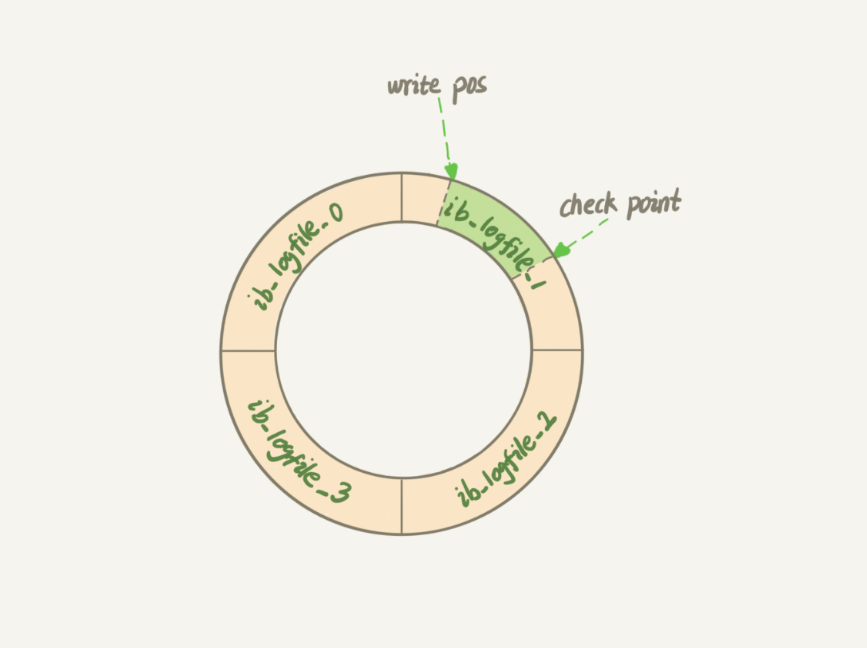
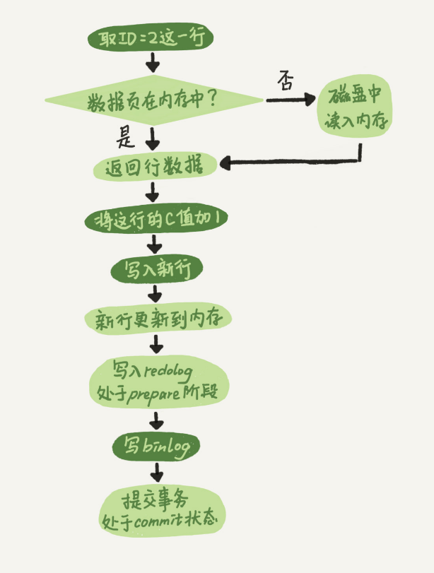

# 一条更新SQL语句的执行流程

与查询流程不一样的是，更新流程还涉及两个重要的日志模块：redo log（重做日志）和 binlog（归档日志）。

## redo log

数据最终是要存储在磁盘上的，如果每一次的更新操作都需要写进磁盘，然后磁盘也要找到对应的那条记录，然后再更新，整个过程 IO 成本、查找成本都很高。
聪明的 MySQL 设计者就用了 WAL 技术，WAL 的全称是 Write-Ahead Logging，它的关键点就是先写日志，再写磁盘。
具体来说，当有一条记录需要更新的时候，InnoDB 引擎就会先把记录写到 redo log 里面，并更新内存，这个时候更新就算完成了。
同时，InnoDB 引擎会在适当的时候，将这个操作记录更新到磁盘里面，而这个更新往往是在系统比较空闲的时候做。

InnoDB 的 redo log 是固定大小的，比如可以配置为一组 4 个文件，每个文件的大小是 1GB，那么总共就可以记录 4GB 的操作。从头开始写，写到末尾就又回到开头循环写。

write pos 是当前记录的位置，一边写一边后移，写到第 3 号文件末尾后就回到 0 号文件开头。checkpoint 是当前要擦除的位置，也是往后推移并且循环的，擦除记录前要把记录更新到数据文件。

write pos 和 checkpoint 之间还空着的部分，可以用来记录新的操作。如果 write pos 追上 checkpoint，这时候不能再执行新的更新，得停下来先擦掉一些记录，把 checkpoint 推进一下。

有了 redo log，InnoDB 就可以保证即使数据库发生异常重启，之前提交的记录都不会丢失，这个能力称为crash-safe。

## bin log

binlog（归档日志）是Server 层的日志。

这两种日志有以下三点不同。

1. redo log 是 InnoDB 引擎特有的；binlog 是 MySQL 的 Server 层实现的，所有引擎都可以使用。

2. redo log 是物理日志，记录的是“在某个数据页上做了什么修改”；binlog 是逻辑日志，记录的是这个语句的原始逻辑，比如“给 id=2 这一行的 age 字段加 1 ”。

3. redo log 是循环写的，空间固定会用完；binlog 是可以追加写入的。“追加写”是指 binlog 文件写到一定大小后会切换到下一个，并不会覆盖以前的日志。

## 更新语句执行流程

表：create table user(id int primary key, age int);

更新语句：update user set age = age + 1 where id = 2;

1. 执行器先找引擎取 id=2 这一行。id 是主键，引擎直接用树搜索找到这一行。如果 id=2 这一行所在的数据页本来就在内存中，就直接返回给执行器；否则，需要先从磁盘读入内存，然后再返回。

2. 执行器拿到引擎给的行数据，把这个值加上 1，比如原来是 N，现在就是 N+1，得到新的一行数据，再调用引擎接口写入这行新数据。

3. 引擎将这行新数据更新到内存中，同时将这个更新操作记录到 redo log 里面，此时 redo log 处于 prepare 状态。然后告知执行器执行完成了，随时可以提交事务。

4. 执行器生成这个操作的 binlog，并把 binlog 写入磁盘。

5. 执行器调用引擎的提交事务接口，引擎把刚刚写入的 redo log 改成提交（commit）状态，更新完成。

3和5将 redo log 的写入拆成了两个步骤：prepare 和 commit，这就是"两阶段提交"。

## 两阶段提交

假设执行 update 语句过程中在写完第一个日志后，第二个日志还没有写完期间发生了 crash，会出现什么情况呢？

1. 先写 redo log 后写 binlog。假设在 redo log 写完，binlog 还没有写完的时候，MySQL 进程异常重启。
由于redo log 写完之后，系统即使崩溃，仍然能够把数据恢复回来，所以恢复后这一行 c 的值是 1。
但是由于 binlog 没写完就 crash 了，这时候 binlog 里面就没有记录这个语句。因此，之后备份日志的时候，存起来的 binlog 里面就没有这条语句。
之后如果需要用这个 binlog 来恢复临时库的话，由于这个语句的 binlog 丢失，这个临时库就会少了这一次更新，恢复出来的这一行 c 的值就是 0，与原库的值不同。

2. 先写 binlog 后写 redo log。如果在 binlog 写完之后 crash，由于 redo log 还没写，崩溃恢复以后这个事务无效，所以这一行 c 的值是 0。
但是 binlog 里面已经记录了“把 c 从 0 改成 1”这个日志。所以，在之后用 binlog 来恢复的时候就多了一个事务出来，恢复出来的这一行 c 的值就是 1，与原库的值不同。

可以看到，如果不使用“两阶段提交”，那么数据库的状态就有可能和用它的日志恢复出来的库的状态不一致。