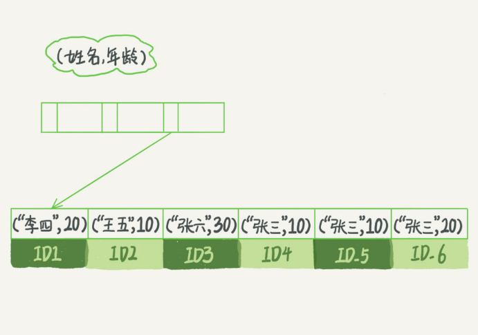

# 索引

索引的出现其实就是为了提高数据查询的效率，就像书的目录一样

## 索引的常见模型

哈希表是一种以键 - 值（key-value）存储数据的结构，我们只要输入待查找的值即 key，就可以找到其对应的值即 Value。但是哈希表这种结构适用于只有等值查询的场景。

有序数组在等值查询和范围查询场景中的性能就都非常优秀，但有序数组索引只适用于静态存储引擎。

二叉树是搜索效率最高的，但是实际上大多数的数据库存储却并不使用二叉树。其原因是，索引不止存在内存中，还要写到磁盘上。为了让一个查询尽量少地读磁盘，就必须让查询过程访问尽量少的数据块。
那么，我们就不应该使用二叉树，而是要使用“N 叉”树。这里，“N 叉”树中的“N”取决于数据块的大小。

## InnoDB索引模型

在 InnoDB 中，表都是根据主键顺序以索引的形式存放的，这种存储方式的表称为索引组织表。每一个索引在 InnoDB 里面对应一棵 B+ 树。

根据叶子节点的内容，索引类型分为主键索引和非主键索引。 
1. 主键索引的叶子节点存的是整行数据。在 InnoDB 里，主键索引也被称为聚簇索引（clustered index）。
2. 非主键索引的叶子节点内容是主键的值。在 InnoDB 里，非主键索引也被称为二级索引（secondary index）。

### 基于主键索引和普通索引的查询有什么区别？

如果语句是 select * from T where ID=500，即主键查询方式，则只需要搜索 ID 这棵 B+ 树；

如果语句是 select * from T where k=5，即普通索引查询方式，则需要先搜索 k 索引树，得到 ID 的值为 500，再到 ID 索引树搜索一次。这个过程称为回表。

也就是说，基于非主键索引的查询需要多扫描一棵索引树，称为回表。因此，我们在应用中应该尽量使用主键查询。

## 索引维护

B+ 树为了维护索引有序性，在插入新值的时候需要做必要的维护。如果插入的记录后边有记录，需要逻辑上挪动后面的数据，空出位置。
而更糟的情况是，如果目标数据页已经满了，根据 B+ 树的算法，这时候需要申请一个新的数据页，然后挪动部分数据过去。这个过程称为页分裂。在这种情况下，性能自然会受影响。
除了性能外，页分裂操作还影响数据页的利用率。原本放在一个页的数据，现在分到两个页中，整体空间利用率降低大约 50%。
当然有分裂就有合并。当相邻两个页由于删除了数据，利用率很低之后，会将数据页做合并。合并的过程，可以认为是分裂过程的逆过程。

### 是否一定要有自增主键

可能在一些建表规范里面见到过类似的描述，要求建表语句里一定要有自增主键。当然事无绝对，我们来分析一下哪些场景下应该使用自增主键，而哪些场景下不应该。

自增主键是指自增列上定义的主键，在建表语句中一般是这么定义的： NOT NULL PRIMARY KEY AUTO_INCREMENT。

插入新记录的时候可以不指定 ID 的值，系统会获取当前 ID 最大值加 1 作为下一条记录的 ID 值。
自增主键的插入数据模式，正符合了递增插入的场景。每次插入一条新记录，都是追加操作，都不涉及到挪动其他记录，也不会触发叶子节点的分裂。
而有业务逻辑的字段做主键，则往往不容易保证有序插入，这样写数据成本相对较高。

除了考虑性能外，还可以从存储空间的角度来看。假设表中确实有一个唯一字段，比如字符串类型的身份证号，那应该用身份证号做主键，还是用自增字段做主键呢？

由于每个非主键索引的叶子节点上都是主键的值。如果用身份证号做主键，那么每个二级索引的叶子节点占用约 20 个字节，而如果用整型做主键，则只要 4 个字节，如果是长整型（bigint）则是 8 个字节。
显然，主键长度越小，普通索引的叶子节点就越小，普通索引占用的空间也就越小。 所以，从性能和存储空间方面考量，自增主键往往是更合理的选择。

## 覆盖索引
如果执行的语句是 select ID from T where k between 3 and 5，这时只需要查 ID 的值，而 ID 的值已经在 k 索引树上了，因此可以直接提供查询结果，不需要回表。也就是说，在这个查询里面，索引 k 已经“覆盖了”我们的查询需求，我们称为覆盖索引。

覆盖索引可以减少树的搜索次数，显著提升查询性能，使用覆盖索引是一个常用的性能优化手段。

### 在一个市民信息表上，是否有必要将身份证号和名字建立联合索引？
身份证号是市民的唯一标识。也就是说，如果有根据身份证号查询市民信息的需求，我们只要在身份证号字段上建立索引就够了。而再建立一个（身份证号、姓名）的联合索引，是不是浪费空间？

如果现在有一个高频请求，要根据市民的身份证号查询他的姓名，这个联合索引就有意义了。它可以在这个高频请求上用到覆盖索引，不再需要回表查整行记录，减少语句的执行时间。

## 最左前缀索引

索引项是按照索引定义里面出现的字段顺序排序的，当逻辑需求是查到所有名字是“张三”的人时，可以快速定位到 ID4，然后向后遍历得到所有需要的结果。

查询条件是"where name like ‘张 %’"。这时，也能够用上这个索引，查找到第一个符合条件的记录是 ID3，然后向后遍历，直到不满足条件为止。

可以看到，不只是索引的全部定义，只要满足最左前缀，就可以利用索引来加速检索。这个最左前缀可以是联合索引的最左 N 个字段，也可以是字符串索引的最左 M 个字符。

### 创建原则
因为可以支持最左前缀，所以当已经有了 (a,b) 这个联合索引后，一般就不需要单独在 a 上建立索引了。因此，第一原则是，如果通过调整顺序，可以少维护一个索引，那么这个顺序往往就是需要优先考虑采用的。

那么，如果既有联合查询，又有基于 a、b 各自的查询呢？查询条件里面只有 b 的语句，是无法使用 (a,b) 这个联合索引的，这时候不得不维护另外一个索引，也就是需要同时维护 (a,b)、(b) 这两个索引。
这时候，要考虑的原则就是空间了。如果 name 字段是比 age 字段大的 ，那最好创建一个（name,age) 的联合索引和一个 (age) 的单字段索引。

## 索引下推

最左前缀可以用于在索引中定位记录，那些不符合最左前缀的部分，会怎么样呢？

像这样一个多条件查询 select * from tuser where name like '张 %' and age=10 and ismale=1; 会如何执行？

根据前缀索引的规则，这个语句在搜索索引树的时候，只能用 “张”，找到第一个满足条件的记录 ID3，然后要判断其他条件是否满足。
在 MySQL 5.6 之前，只能从 ID3 开始一个个回表。到主键索引上找出数据行，再对比字段值。
而 MySQL 5.6 引入的索引下推优化（index condition pushdown)， 可以在索引遍历过程中，对索引中包含的字段先做判断，直接过滤掉不满足条件的记录，减少回表次数。

如何理解：InnoDB 在 (name,age) 索引内部就判断了 age 是否等于 10，对于不等于 10 的记录，直接判断并跳过。
以上面图中数据为例，只需要对 ID4、ID5 这两条记录回表取数据判断，就只需要回表 2 次。